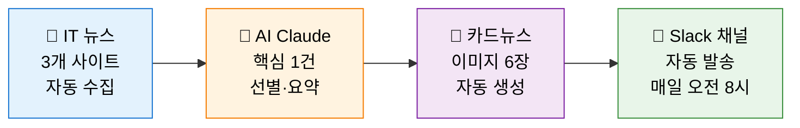

# 오늘의 IT 뉴스 봇

> **매일 아침 8시, 가장 중요한 IT 뉴스 1건을 AI가 골라 카드뉴스로 만들어 Slack 채널에 자동 발송하는 봇**

사내에서 반복적으로 발생하는 "정보 수집 → 정리 → 공유" 업무를 직접 자동화할 수 있는지 검증하기 위해 만든 개인 프로젝트입니다.

---

## 어떻게 동작하나요?



1. **수집** — 전자신문, AI타임스, GeekNews 3개 사이트의 최근 24시간 기사를 모아옴
2. **선별** — Claude(Sonnet 4.6)가 *업계 파급력 / 독자 관심도 / 장기적 중요성* 기준으로 가장 중요한 1건 선정
3. **요약** — 본문을 읽고 핵심 포인트 3개, 파급효과, 생각해볼 질문을 카드 형식으로 정리
4. **카드 생성** — 표지 + 핵심 요약 3장 + 파급효과 1장 + 질문 1장, 총 6장의 이미지로 디자인
5. **발송** — 매일 한국 시간 오전 8시, GitHub Actions가 자동으로 실행해 Slack 채널에 전송
6. **중복 방지** — 이미 보낸 기사는 다시 보내지 않도록 URL 이력 관리

---

## 결과물 예시

매일 아침 슬랙 채널에 이런 메시지가 도착합니다:

- **헤드라인**: *GPT-5, 추론의 차원이 달라진다*
- **출처**: GeekNews
- **카드 6장** (스와이프해서 보는 형식)
  1. 표지 — 임팩트 한 줄
  2. 핵심 포인트 ① — 무슨 일이 일어났는가
  3. 핵심 포인트 ② — 왜 중요한가
  4. 핵심 포인트 ③ — 어떻게 진행되는가
  5. 🌊 파급효과 — 업계·시장·사용자에 미칠 영향
  6. 💭 생각해볼 질문 — 독자가 자기 일에 연결해볼 수 있는 질문
- **원문 링크**: 더 자세히 알고 싶으면 클릭

각 카드의 핵심 구절은 **노란 형광펜**으로 강조되어 있어 빠르게 훑기 좋게 했습니다.

---

## 기술 스택 (개발자용)

| 영역 | 도구 |
|---|---|
| 언어 | Python 3.11 |
| AI | Anthropic Claude (Sonnet 4.6) — 기사 선정 + 구조화된 카드 생성 |
| 데이터 수집 | feedparser (RSS), newspaper3k (본문 추출) |
| 이미지 생성 | Pillow (PIL) — 폰트, 형광펜, 이모지 처리 |
| 메신저 | Slack SDK (`files_upload_v2`) — 텔레그램으로도 전환 가능 |
| 자동화 | GitHub Actions (cron 스케줄) |
| 개발 도구 | Claude Code |

### 설계 포인트
- **Sender 추상화**: Slack ↔ Telegram을 환경 변수 한 줄(`SENDER=slack`)로 전환 가능
- **Lazy Import**: 한쪽 의존성만 설치된 환경에서도 동작
- **상태 관리**: 발송 이력(`sent_urls.txt`)을 GitHub Actions가 매일 커밋해 다음 실행에 반영

---

## 개발 기간 & 회고

**개발 기간**: 2일 (2026.04.17 — 04.18)
**확장 작업**: Slack 채널 지원 추가 (2026.04.29)

### 무엇을 배웠나
- AI 코딩 도구(Claude Code)를 적극 활용해 짧은 시간에 *기획 → 개발 → 운영* 전 과정을 단독으로 완성
- 외부 API(Anthropic, Slack), 데이터 수집(RSS), 이미지 생성(PIL), 자동화(Actions)를 하나의 파이프라인으로 통합하는 경험
- "정보 큐레이션" 같은 반복 업무를 자동화하는 패턴 — 사내 공지, 회의록 요약, 트렌드 리포트 등에 동일하게 응용 가능

### 사내 응용 시나리오
- 부서별 관심 키워드를 입력받아 매일 정리해 발송
- 회의록을 자동 요약해 채널에 공유
- 사내 KPI 대시보드를 캡처해 정기 리포트로 발송
- 신규 입사자 온보딩 자료를 카드뉴스 형식으로 자동 생성

---

## 직접 돌려보고 싶다면

<details>
<summary>로컬 실행 (펼치기)</summary>

### 1. 의존성 설치
```bash
pip install -r requirements.txt
```

### 2. 폰트 다운로드 (이미 포함되어 있으면 생략)
```bash
mkdir -p assets
BASE="https://github.com/orioncactus/pretendard/raw/main/packages/pretendard/dist/public/static"
curl -sSL -o assets/Pretendard-Regular.ttf  "$BASE/Pretendard-Regular.ttf"
curl -sSL -o assets/Pretendard-SemiBold.ttf "$BASE/Pretendard-SemiBold.ttf"
curl -sSL -o assets/Pretendard-Bold.ttf    "$BASE/Pretendard-Bold.ttf"
```

### 3. 환경 변수 설정
```bash
cp .env.example .env
# .env 파일에 아래 값 입력
```

| 변수 | 설명 |
|---|---|
| `ANTHROPIC_API_KEY` | Anthropic Console에서 발급 |
| `SENDER` | `slack` 또는 `telegram` |
| `SLACK_BOT_TOKEN` | Slack 앱 생성 후 받은 `xoxb-...` 토큰 (`chat:write`, `files:write` 권한 필요) |
| `SLACK_CHANNEL_ID` | 채널 우클릭 → 링크 복사 → URL 끝부분 `C0XXXXXXX` |

### 4. 실행
```bash
python main.py
```

</details>

<details>
<summary>GitHub Actions로 매일 자동 실행 (펼치기)</summary>

1. 이 레포를 본인 계정으로 fork 또는 clone
2. **Settings → Secrets and variables → Actions** 에서 시크릿 등록
   - `ANTHROPIC_API_KEY`
   - `SLACK_BOT_TOKEN`
   - `SLACK_CHANNEL_ID`
3. **Actions** 탭 → `Daily IT News` → `Run workflow` 로 수동 테스트
4. 이후 매일 한국시간 오전 8시 자동 실행

</details>

---

## 파일 구조

```
it-news-bot/
├── main.py                          # 전체 파이프라인 진입점
├── src/
│   ├── rss_fetcher.py               # RSS 3개 수집 + 24시간 필터 + 중복 제거
│   ├── article_scraper.py           # 기사 본문 추출
│   ├── claude_agent.py              # Claude로 Top 1 선정 + 카드 내용 생성
│   ├── card_generator.py            # Pillow로 PNG 카드 6장 렌더
│   ├── telegram_sender.py           # 텔레그램 저수준 API 호출
│   └── senders/
│       ├── __init__.py              # 채널 팩토리 (env로 슬랙/텔레그램 선택)
│       ├── base.py                  # Sender Protocol
│       ├── telegram.py              # 텔레그램 어댑터
│       ├── slack.py                 # 슬랙 어댑터 (files_upload_v2)
│       └── blocks.py                # Slack Block Kit JSON 빌더 (옵션)
├── assets/                          # Pretendard 폰트 + 이모지 PNG
├── .github/workflows/daily.yml      # 매일 8시 cron 스케줄
├── requirements.txt
└── sent_urls.txt                    # 발송 이력 (자동 갱신)
```
