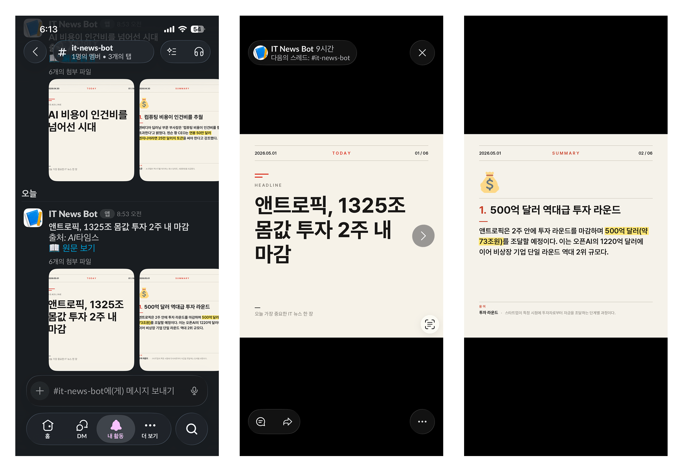
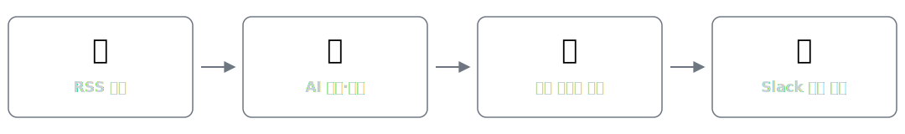
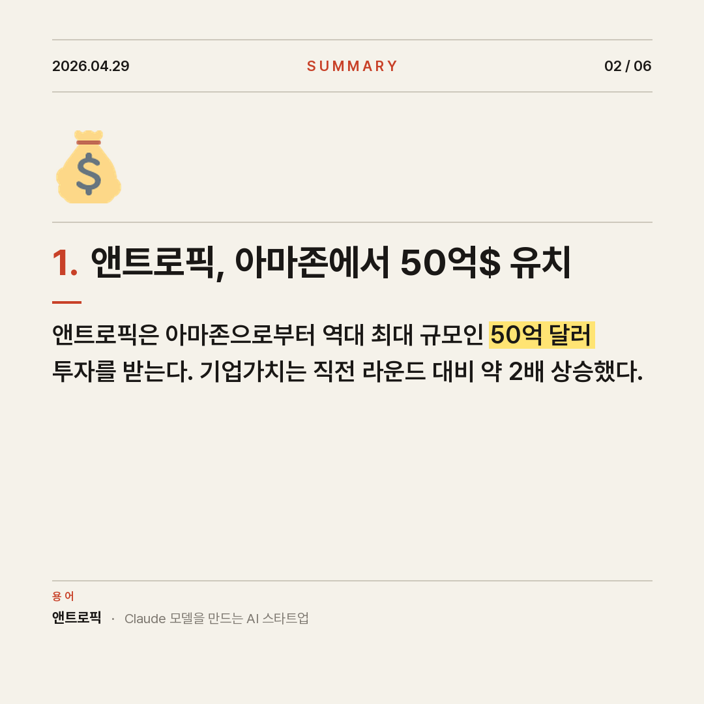
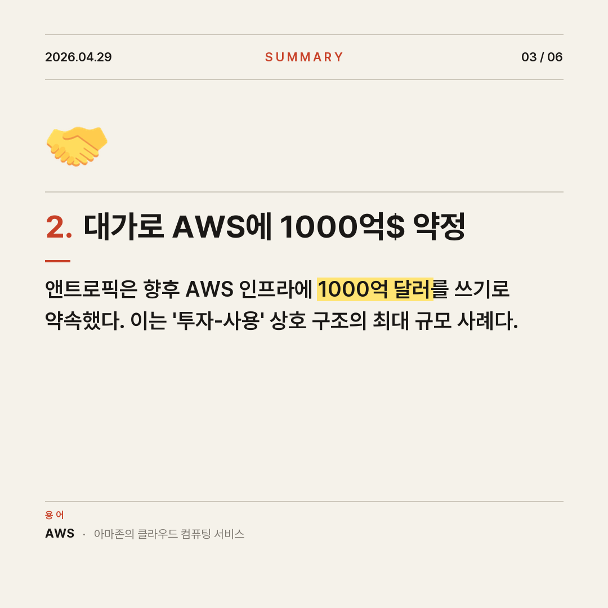
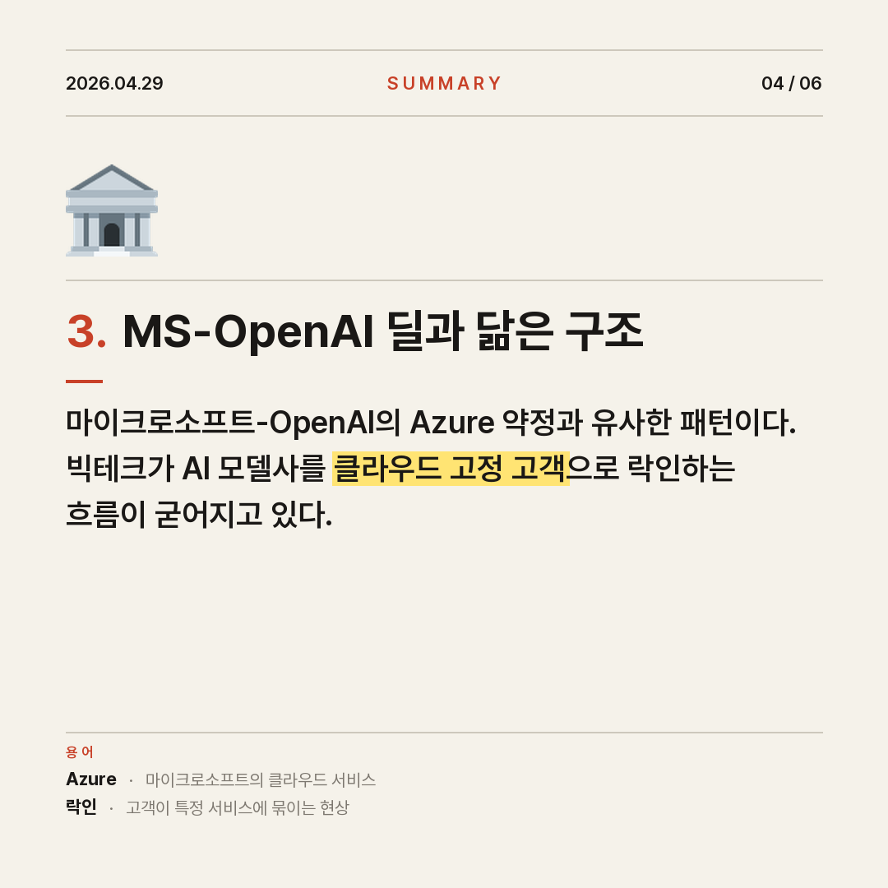
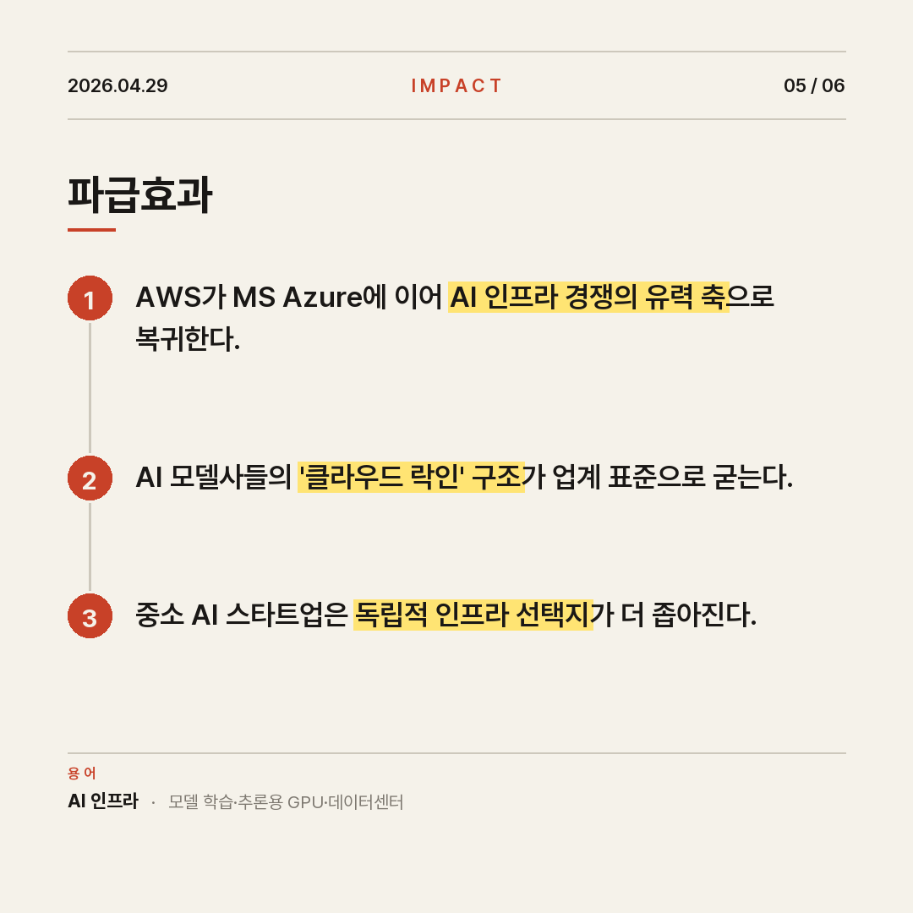

# 오늘의 IT 뉴스 봇

> **매일 아침 8시, 가장 중요한 IT 뉴스 1건을 AI가 골라 카드뉴스로 만들어 Slack 채널에 자동 발송하는 봇**

평소 IT 뉴스를 잘 챙겨보지 않고, 줄글 요약은 한눈에 들어오지 않는다는 개인적인 문제에서 출발했습니다. **“매일 아침 카드 6장만 보면 오늘의 IT 흐름 한 줄을 잡는다”** 를 목표로, 수집·선별·요약·시각화·전송을 모두 자동화한 개인 프로젝트입니다.

---

## 실제 발송 화면

<p align="center">
  
</p>

> 매일 아침 Slack 채널에 위와 같이 카드뉴스 6장이 묶음으로 도착합니다. 한 장씩 넘겨보며 오늘의 IT 흐름을 확인할 수 있습니다.

---

## 어떻게 동작하나요?

#### 한 줄 요약

<p align="center">
  
</p>

#### 단계별 상세

| # | 단계 | 도구 | 결과물 |
|:---:|---|---|---|
| 1 | **수집** | RSS (전자신문 · AI타임스 · GeekNews) | 최근 24시간 기사 ~30건 |
| 2 | **선별** | Claude Sonnet 4.6 | 업계 파급력·독자 관심도·장기 중요성 기준 Top 1 |
| 3 | **요약** | Claude Sonnet 4.6 | 헤드라인 + 핵심 포인트 3 + 파급효과 + 질문 |
| 4 | **디자인** | Pillow (Python) | PNG 카드 6장 (표지 + 본문 5장) |
| 5 | **발송** | Slack API | 채널에 카드 묶음 + 원문 링크 자동 게시 |
| 6 | **이력 관리** | GitHub Actions | 발송한 URL 기록 → 다음날 중복 발송 방지 |

> 매일 한국 시간 **오전 8시**에 GitHub Actions가 위 6단계를 자동 실행합니다.

---

## 결과물 예시

매일 아침 슬랙 채널에 카드 6장이 묶음으로 도착합니다. 각 카드의 핵심 구절은 **노란 형광펜**으로 강조되어 빠르게 훑기 좋습니다.

| | |
|:---:|:---:|
| **① 표지** | **② 핵심 포인트 1** |
|  |  |
| **③ 핵심 포인트 2** | **④ 핵심 포인트 3** |
|  |  |
| **⑤ 파급효과** | **⑥ 생각해볼 질문** |
|  |  |

> 마지막으로 *원문 링크* 가 함께 전송되어 더 깊이 알고 싶은 사람은 바로 기사로 이동할 수 있습니다.

---

## 기술 스택 (개발자용)

| 영역 | 도구 |
|---|---|
| 언어 | Python 3.11 |
| AI | Anthropic Claude (Sonnet 4.6) — 기사 선정 + 구조화된 카드 생성 |
| 데이터 수집 | feedparser (RSS), newspaper3k (본문 추출) |
| 이미지 생성 | Pillow (PIL) — 폰트, 형광펜, 이모지 처리 |
| 메신저 | Slack SDK (`files_upload_v2`) — 텔레그램으로도 전환 가능 |
| 자동화 | GitHub Actions (cron 스케줄) |
| 개발 도구 | Claude Code |

### 설계 포인트
- **Sender 추상화**: Slack ↔ Telegram을 환경 변수 한 줄(`SENDER=slack`)로 전환 가능
- **Lazy Import**: 한쪽 의존성만 설치된 환경에서도 동작
- **상태 관리**: 발송 이력(`sent_urls.txt`)을 GitHub Actions가 매일 커밋해 다음 실행에 반영

---

## 직접 돌려보고 싶다면

<details>
<summary>로컬 실행 (펼치기)</summary>

### 1. 의존성 설치
```bash
pip install -r requirements.txt
```

### 2. 폰트 다운로드 (이미 포함되어 있으면 생략)
```bash
mkdir -p assets
BASE="https://github.com/orioncactus/pretendard/raw/main/packages/pretendard/dist/public/static"
curl -sSL -o assets/Pretendard-Regular.ttf  "$BASE/Pretendard-Regular.ttf"
curl -sSL -o assets/Pretendard-SemiBold.ttf "$BASE/Pretendard-SemiBold.ttf"
curl -sSL -o assets/Pretendard-Bold.ttf    "$BASE/Pretendard-Bold.ttf"
```

### 3. 환경 변수 설정
```bash
cp .env.example .env
# .env 파일에 아래 값 입력
```

| 변수 | 설명 |
|---|---|
| `ANTHROPIC_API_KEY` | Anthropic Console에서 발급 |
| `SENDER` | `slack` 또는 `telegram` |
| `SLACK_BOT_TOKEN` | Slack 앱 생성 후 받은 `xoxb-...` 토큰 (`chat:write`, `files:write` 권한 필요) |
| `SLACK_CHANNEL_ID` | 채널 우클릭 → 링크 복사 → URL 끝부분 `C0XXXXXXX` |

### 4. 실행
```bash
python main.py
```

</details>

<details>
<summary>GitHub Actions로 매일 자동 실행 (펼치기)</summary>

1. 이 레포를 본인 계정으로 fork 또는 clone
2. **Settings → Secrets and variables → Actions** 에서 시크릿 등록
   - `ANTHROPIC_API_KEY`
   - `SLACK_BOT_TOKEN`
   - `SLACK_CHANNEL_ID`
3. **Actions** 탭 → `Daily IT News` → `Run workflow` 로 수동 테스트
4. 이후 매일 한국시간 오전 8시 자동 실행

</details>

---

## 파일 구조

```
it-news-bot/
├── main.py                          # 전체 파이프라인 진입점
├── src/
│   ├── rss_fetcher.py               # RSS 3개 수집 + 24시간 필터 + 중복 제거
│   ├── article_scraper.py           # 기사 본문 추출
│   ├── claude_agent.py              # Claude로 Top 1 선정 + 카드 내용 생성
│   ├── card_generator.py            # Pillow로 PNG 카드 6장 렌더
│   ├── telegram_sender.py           # 텔레그램 저수준 API 호출
│   └── senders/
│       ├── __init__.py              # 채널 팩토리 (env로 슬랙/텔레그램 선택)
│       ├── base.py                  # Sender Protocol
│       ├── telegram.py              # 텔레그램 어댑터
│       ├── slack.py                 # 슬랙 어댑터 (files_upload_v2)
│       └── blocks.py                # Slack Block Kit JSON 빌더 (옵션)
├── assets/                          # Pretendard 폰트 + 이모지 PNG
├── .github/workflows/daily.yml      # 매일 8시 cron 스케줄
├── requirements.txt
└── sent_urls.txt                    # 발송 이력 (자동 갱신)
```
